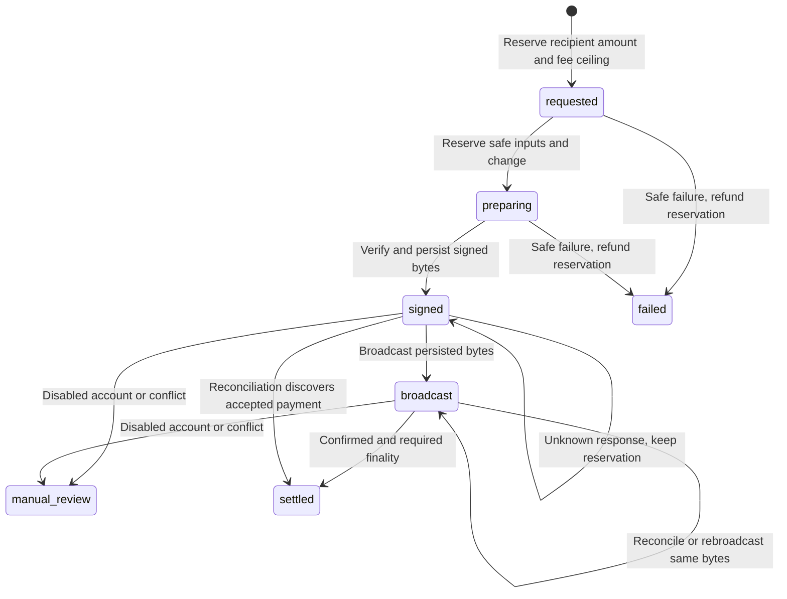

# eCash funding and settlement

Zoko accepts the native **eCash XEC cryptocurrency**. It does not use Cashu, Lightning, a synthetic token, or an exchange balance. Individual decisions use a prepaid PostgreSQL ledger; deposits and withdrawals use real XEC transactions. Customer funds are held by the operator's dedicated Bitcoin ABC wallet. This is custodial accounting, not a trustless escrow protocol.

## Amounts and fee contract

| Quantity | Exact value |
|---|---:|
| 1 XEC | 1,000,000,000 nanoXEC in the ledger |
| 1 on-chain atom | 0.01 XEC = 10,000,000 nanoXEC |
| Conservative standard withdrawal minimum | 546 atoms = 5.46 XEC = 5,460,000,000 nanoXEC |
| Default funding fee rate | 10.00 XEC/kB = 1,000 atoms/kB |
| Default maximum fee rate | 100.00 XEC/kB |
| Default withdrawal fee reserve | 100 XEC = 100,000,000,000 nanoXEC |

The native unit and dust/fee defaults follow [Bitcoin ABC's currency definition](https://github.com/Bitcoin-ABC/bitcoin-abc/blob/master/src/consensus/amount.cpp) and [eCash library constants](https://github.com/Bitcoin-ABC/bitcoin-abc/blob/master/modules/ecash-lib/src/consts.ts). Dust is a standard relay policy, not the smallest consensus amount; Zoko uses the conservative 546-atom threshold for supported withdrawal destinations.

Every public money field is a decimal integer **string** in nanoXEC. The internal ledger supports subatomic prices; that does not make subatomic on-chain payments possible. Fractional remainders stay in the account until more earnings or deposits accumulate. There is no silent rounding.

`POST /v1/withdrawals` takes `amountNanos` as the **exact amount the recipient will receive**. On acceptance, Zoko reserves `amountNanos + maxFeeNanos`. The response exposes both values and `reservedNanos`. After the transaction meets the configured finality policy, Zoko charges the actual network fee and returns the unused fee reserve to the account. A safe failure before durable signing returns the entire reserve. A network failure after durable signing does not refund an uncertain payment.

Bitcoin ABC RPC accepts exact decimal amount strings. Zoko sends those strings, and parses returned JSON numeric tokens from their original lexical representation using Node 24's JSON reviver context. The application's monetary calculations never rely on the rounded JavaScript number produced by ordinary JSON parsing.

## Provision the dedicated node and wallet

Use an officially distributed, current compatible [Bitcoin ABC node](https://www.bitcoinabc.org/) with its own persistent data directory. Keep its wallet, chain state and backups independent of the Zoko application image. The application does not create a node or possess a seed phrase.

Relevant node configuration is:

```ini
server=1
ecash=1
txindex=1
chronik=1
chroniktokenindex=1
```

Chronik can run on the same node or on another operator-trusted node. If it is separate, both endpoints must agree on the configured network and canonical chain. Chronik defaults to loopback port 8331 on mainnet; use the appropriate endpoint for your network. Initial node and index synchronization can take days. [Official Chronik setup](https://docs.e.cash/chronik/setup/setup-chronik/)

Configure RPC authentication using Bitcoin ABC's `rpcauth` mechanism or your existing protected RPC administration. Bind and allow RPC only on the private interfaces required for the application. The Compose API reaches a host node through `host.docker.internal` when configured that way; the node must separately permit that private connection. Zoko refuses redirects and URL-embedded credentials. Do not publish wallet RPC through the public website proxy.

From the node's protected administration environment, create and back up a dedicated wallet:

```bash
bitcoin-cli createwallet zoko
```

Set `ABC_RPC_WALLET=zoko`. Ensure the wallet is loaded after node restart using the node's wallet-loading configuration. Back up its keys before assigning addresses. If the wallet is encrypted, arrange operator-controlled unlocking through Bitcoin ABC's administrative channel. Zoko does not store a wallet passphrase and does not unlock wallets. Readiness fails while the signing wallet is locked.

Use this wallet exclusively for Zoko's address allocation, input selection and outgoing transactions. Do not run a second independent application, a restored copy, or discretionary manual sends against the same wallet. The workers coordinate across Zoko processes through a PostgreSQL advisory lock, durable input reservations and node locks; an unrelated sender would bypass that coordination.

The service RPC credential needs these methods:

```text
getcurrencyinfo getblockchaininfo getwalletinfo getnetworkinfo
getavalancheinfo getblockhash getaddressinfo getnewaddress
getrawchangeaddress gettransaction isfinaltransaction listsinceblock
listlockunspent gettxout lockunspent listunspent createrawtransaction
fundrawtransaction decoderawtransaction signrawtransactionwithwallet
testmempoolaccept sendrawtransaction
```

It does not need wallet export, seed import, wallet encryption administration, `sendmany`, or `sendtoaddress`. Apply a method allowlist if your node/proxy setup supports one while preserving your separate administrative access.

## Configuration and read-only preflight

Set:

```dotenv
ZOKO_PAYMENTS_ENABLED=true
XEC_NETWORK=mainnet
ABC_RPC_URL=http://host.docker.internal:8332
ABC_RPC_USERNAME=your-dedicated-rpc-user
ABC_RPC_PASSWORD=your-rpc-secret
ABC_RPC_WALLET=zoko
CHRONIK_URLS=https://chronik.e.cash
XEC_CONFIRMATIONS=6
XEC_REQUIRE_FINALIZED=true
XEC_MAX_FEE_NANOS=100000000000
XEC_FEE_RATE=10.00
XEC_MAX_FEE_RATE=100.00
```

Public Chronik endpoints are third-party infrastructure. For an operator-controlled dependency and service capacity, run a synchronized instance and configure its private URL. A configured fallback is selected only after validating it against the wallet node. Zoko does not silently switch to an unchecked indexer.

Run `npm run doctor` for read-only checks. The payment preflight verifies:

1. `getcurrencyinfo` reports `ticker=XEC`, `satoshisperunit=100`, and `decimals=2`. Legacy `ecash=0` denomination is rejected.
2. Bitcoin ABC reports the configured network, a synchronized chain and wallet, enabled private keys, a usable signing state, and network peers outside regtest.
3. Chronik has the same genesis and canonical tip hash at its reported height, within a two-block synchronization tolerance.
4. The token index passes a **positive** canary: metadata and token-bearing outputs for a known token genesis must be present. A 404 does not prove token-index capability.
5. If required, Bitcoin ABC has an established Avalanche polling quorum.
6. After the first payment mutation, the node still owns the ledger's persisted identity address. A different wallet seed under the same wallet name is rejected.

The first address allocation or withdrawal request binds the database to a generated wallet identity address, network, genesis hash and wallet name. This mutation happens in an explicit payment operation, never in doctor/preflight. Do not edit that identity to bypass a failed ownership check.

On mainnet the positive token canary defaults to the official example genesis `cdcdcdcdcdc9dda4c92bb1145aa84945c024346ea66fd4b699e344e45df2e145`. For testnet or regtest set `XEC_TOKEN_PROBE_TXID` to an existing token genesis on that network. [Official token API example](https://docs.e.cash/chronik/chronik-client/tokens/)

Keep token indexing enabled even though Zoko accepts only native XEC. Chronik with token indexing disabled can omit token annotations and skip burn checks. Zoko repeats the positive canary during preflight and before payout processing, rather than treating missing token fields alone as sufficient proof. [Official token-index guidance](https://docs.e.cash/chronik/setup/setup-chronik/)

## Deposits

Allocate an account's address with `POST /v1/deposit-address`. The address is durable, uniquely assigned, and generated by the dedicated wallet. Mainnet addresses must explicitly use `ecash:`; test/regtest prefixes are accepted only on their configured networks. Zoko compares decoded output scripts, not superficial address spelling.

The worker reads wallet `listsinceblock` history, including removed transactions. It commits all discovered transaction IDs and the next block cursor together, then verifies and credits outputs independently. Pending transactions keep being polled after the history cursor advances. A failed transaction does not discard later discoveries. The initial cursor scans the dedicated wallet's history; large history responses fail at a 16 MiB transport bound without advancing the cursor. Keep the wallet dedicated and run the worker continuously; an oversized historical catch-up requires operator-assisted reconciliation, never cursor skipping.

`POST /v1/deposits/claim` with a transaction ID accelerates verification. It never establishes payment ownership: the transaction must first contain an output matching the claimant's already assigned address. A foreign claim is rejected before it can queue or change another account's deposit. The globally unique `(network, txid, vout)` key and idempotent journal reference prevent repeated claims, overlapping syncs or restarts from minting another credit. Automatic wallet synchronization handles transactions funding multiple registered accounts; each receives only its own matching outputs.

The wallet transaction bytes, computed transaction ID, input references, output scripts/amounts, mining block and Chronik evidence must agree. Deposits become spendable only at the configured confirmation depth and, by default, after both Chronik and the Bitcoin ABC `isfinaltransaction` RPC report Avalanche finality. Ordinary transactions require six confirmations by default; coinbase outputs require at least 101. Merely entering the mempool or a block does not satisfy the default policy. [Bitcoin ABC finality RPC](https://github.com/Bitcoin-ABC/bitcoin-abc/blob/master/src/rpc/avalanche.cpp)

Token-bearing transactions, including zero-quantity mint batons, are unsupported and do not receive a native-XEC credit under this policy. Deposit accounting uses historical outputs, not current unspent balances: sweeping an output does not remove the existing customer liability.

If a previously credited deposit loses its accepted chain/finality evidence or the sources contradict each other, the deposit enters `reorg_review` and its account is disabled. The service preserves the journal instead of deleting history or forcing a negative customer balance. Unsigned withdrawals for that account are cancelled with reservation refunds; signed payments are reconciled and held for review before any further broadcast. A temporary RPC/indexer outage leaves the account enabled and the deposit pending re-verification; outgoing payments pause until the already credited evidence is successfully rechecked. A concurrent new discovery cannot be cleared by an older verification response because queue completion compares its captured revision.

## Withdrawal state machine



One worker serializes wallet processing across application processes with a PostgreSQL session advisory lock. It chooses confirmed plain-XEC inputs, excluding every durable pending reservation, and persists those outpoints before funding/signing. It sets an explicit wallet-owned change address and disables automatic additional inputs. This prevents the node's token-unaware coin selection from spending unsolicited token outputs.

Bitcoin ABC creates, funds and signs the transaction with `ALL|FORKID`. Zoko verifies the exact recipient amount, no extra recipient, the allowed change script, unchanged inputs, the actual input/output fee, the absolute fee reserve, the maximum fee rate, and token safety. `testmempoolaccept` must succeed. Signing cryptography remains in Bitcoin ABC.

Only after signed bytes and their transaction ID are committed does the worker call `sendrawtransaction`. The attempt counter is also durable before the call. A timeout is an unknown result, not proof of failure. Every retry uses the same bytes and transaction ID. The service never retries `sendmany`, generates a fresh replacement for an uncertain withdrawal, or refunds a signed payment merely because it is missing from an indexer.

Node input locks are memory-only. After a node restart the worker restores locks for persisted preparing/signed/broadcast/review inputs before selecting another payout. Already spent inputs do not need restoration. Reservation records remain the durable authority. An unsigned failure releases its ledger reservation and attempts to unlock only its own inputs; a failed unlock is safe but can reduce liquidity until the operator reconciles the orphan lock.

Withdrawals are processed individually with a bounded number per worker cycle, and each transaction may consolidate multiple wallet inputs. The implementation does not claim multi-recipient settlement batching. Tiny decision prices accumulate in the ledger until users request economical on-chain withdrawals.

## Recovery and acceptance

Keep the database, wallet backup and application configuration as coordinated recovery material. The database contains address ownership, pending input reservations, signed transactions and the financial journal. A stale database restored while the old deployment still sends payments can duplicate economic obligations; never run both copies.

If a withdrawal has signed bytes, preserve its reservation while investigating. Match the stored bytes/transaction ID to wallet and chain evidence. Re-enable an account only after its deposit/chain issue is understood. A `manual_review` row deliberately requires operator review; do not change it to `requested`, erase its signed bytes, or issue a replacement transaction. Recovery must either continue reconciliation of the same transaction or follow an explicitly reviewed accounting correction supported by on-chain evidence.

Run the unit and real-PostgreSQL integration suites before deployment. Then complete one small real deposit, priced decision and withdrawal using the final operator credentials and record the resulting transaction IDs, exact recipient amounts, fees and ledger audit. Passing tests and doctor are not evidence that a real payment has settled; only observed network acceptance and the configured finality checks establish that outcome.

The code does not contact a live wallet or move funds merely by installing dependencies, compiling, running unit tests, or invoking the read-only doctor. The running application's enabled worker processes explicitly requested withdrawals once the real dependencies are configured.
