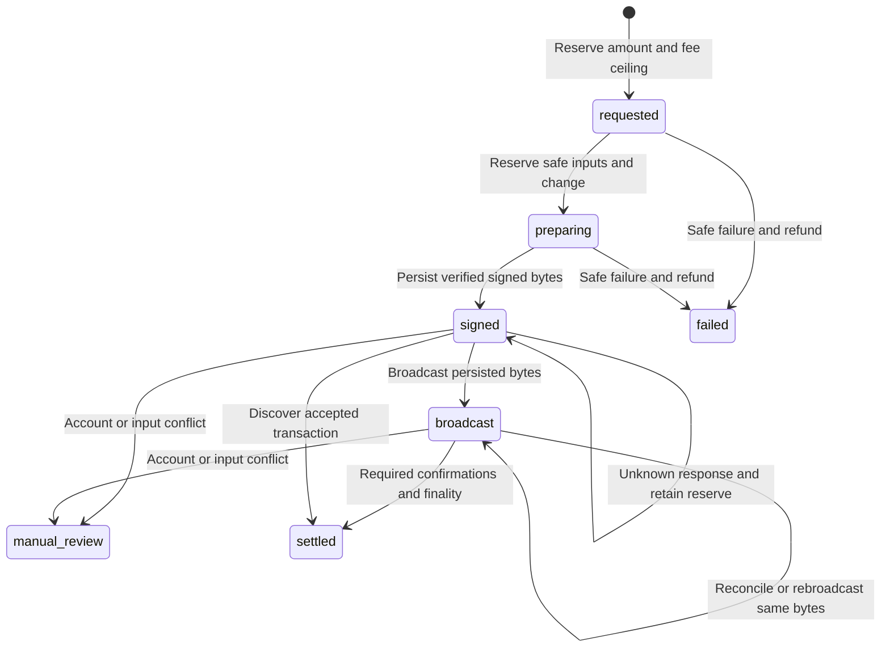

# eCash funding and settlement

Zoko accepts native **eCash XEC**. Decisions settle in its prepaid PostgreSQL ledger; deposits and withdrawals settle on-chain. The API derives addresses and signs withdrawals using a dedicated HD service wallet, then uses hosted Chronik for transaction evidence and broadcast. The customer can approve a deposit in Cashtab. Customer recovery phrases and wallet credentials remain with the customer.

This is a custodial service. The operator controls the dedicated service seed and owes each customer's ledger balance. Hosted Chronik is an explicit source of trusted chain, token and finality information. Running Zoko does not require running a blockchain node, synchronizing an index or configuring wallet RPC.

## Amounts and fees

| Quantity | Exact value |
|---|---:|
| 1 XEC | 1,000,000,000 nanoXEC in the ledger |
| 1 on-chain atom | 0.01 XEC = 10,000,000 nanoXEC |
| Supported withdrawal minimum | 546 atoms = 5.46 XEC = 5,460,000,000 nanoXEC |
| Default signing fee rate | 10.00 XEC/kB = 1,000 atoms/kB |
| Default maximum fee rate | 100.00 XEC/kB |
| Default withdrawal fee reserve | 100 XEC = 100,000,000,000 nanoXEC |

The denomination and conservative dust threshold follow the [eCash library constants](https://github.com/Bitcoin-ABC/bitcoin-abc/blob/master/modules/ecash-lib/src/consts.ts). Dust is a relay-policy limit, not the smallest representable on-chain amount. Every API money field is a decimal integer **string** in nanoXEC. The ledger can price decisions below one on-chain atom; fractional remainders stay in the account until more value accumulates. There is no silent rounding into a blockchain payment.

`POST /v1/withdrawals` takes `amountNanos` as the **exact amount the recipient receives**. Acceptance reserves that amount plus `XEC_MAX_FEE_NANOS`. After the transaction meets the configured confirmation/finality policy, the actual network fee is charged and the unused reserve is released. A safe failure before durable signing releases the entire reservation. An unknown broadcast result after signing does not establish that a payment failed.

All wallet amounts, input values, outputs and fees use exact integer arithmetic. Fee rates are configured as exact XEC-per-kB decimal strings and converted without floating-point money calculations. The quoted model price, hosted service charges if any, and blockchain fees are separate economic quantities.

## Dedicated service wallet

Run setup from the repository:

```bash
npm run init
```

It generates `XEC_WALLET_SEED_HEX` from 32 cryptographically random bytes and writes the result as 64 lowercase hexadecimal characters in `.env`. This seed is independent of the database password, administrator token and provider encryption key. Setup writes no secret value to the terminal and refuses to replace an existing file or configured seed.

The wallet uses BIP32 derivation at `m/44'/1899'/0'/branch/index`, with branch `0` for receiving and branch `1` for change. PostgreSQL records assigned derivation indexes, scripts and account ownership. The configured network determines the address prefix: `ecash` on mainnet, `ectest` on testnet and `ecregtest` on regtest. The implementation uses the [Bitcoin ABC eCash library](https://github.com/Bitcoin-ABC/bitcoin-abc/tree/master/modules/ecash-lib) for cryptographic wallet operations.

Keep this seed dedicated to one Zoko deployment and its coordinated recovery. It is a server signing secret: compromise permits spending the service's on-chain funds. Keep `.env` outside the repository, restrict its file permissions and retain an encrypted off-host backup. Never paste a personal Cashtab recovery phrase into Zoko or import the service secret into a customer's wallet.

The database and seed must be restored together. The seed can derive keys, but it cannot determine which unspent or unused address belonged to which buyer, recover lost spending budgets, or reconstruct every pending withdrawal obligation. A persisted wallet identity rejects an accidental seed or network substitution. Do not edit identity records to suppress that check.

For an existing **empty** setup missing this field, use:

```bash
npm run init -- --add-wallet
```

This adds a missing/empty service seed without replacing other secrets. It is not a funded-wallet migration or seed-rotation command. For funded service recovery, restore the original seed. If setup reports a remaining `.env.init.lock` after interruption, first ensure no setup process is active before removing that lock and retrying.

## Hosted blockchain access

Mainnet defaults are:

```dotenv
ZOKO_PAYMENTS_ENABLED=true
XEC_NETWORK=mainnet
# Generated by npm run init; retain the generated value privately.
XEC_WALLET_SEED_HEX=GENERATED_SERVICE_SEED
CHRONIK_URLS=https://chronik.e.cash,https://chronik-native2.fabien.cash
XEC_CONFIRMATIONS=6
XEC_REQUIRE_FINALIZED=true
XEC_MAX_FEE_NANOS=100000000000
XEC_FEE_RATE=10.00
XEC_MAX_FEE_RATE=100.00
```

The seed placeholder above is explanatory and is rejected by the application. Use the real value created by setup. Mainnet must match the pinned XEC post-fork checkpoint at height **896800**; a matching shared genesis alone is insufficient. Testnet must match its checkpoint at height **1661000**. The exact hashes are defined in [payment configuration](../src/payments/config.ts). For testnet or regtest, additionally configure `XEC_GENESIS_HASH` and `XEC_TOKEN_PROBE_TXID` from that network; default mainnet evidence cannot establish another network's identity. Regtest has no post-fork checkpoint requirement.

`CHRONIK_URLS` accepts one to eight distinct operator-trusted endpoints, separated by commas. Production mainnet/testnet require HTTPS. Each selected endpoint must pass the configured chain and positive token-index checks. The defaults try `chronik.e.cash` and then `chronik-native2.fabien.cash` for availability. The application selects a trusted source; this failover is not an independent quorum. The selected source's availability, completeness, rate limits and reported chain/finality status affect funding and settlement.

Preflight rejects a mainnet tip older than **2 hours**, a testnet tip older than **24 hours**, or either network's tip more than **2 hours in the future** relative to the host clock. Regtest is exempt from the timestamp check. The worker also rejects an endpoint behind its previously accepted chain anchor and pauses outgoing work when that anchor changes, while deposits are reverified. Keep the host clock correct; these are fixed service freshness policies.

Zoko checks transaction bytes, IDs, scripts, amounts, configured chain anchors and evidence consistency. Those checks reject malformed or contradictory responses. They do **not** independently execute blockchain consensus, prove the provider's canonical-chain selection or verify Avalanche quorum decisions. A source that lies consistently can still violate this trust assumption. Choose a hosted endpoint whose operational and security properties meet your service requirements, and monitor outages and delayed indexing.

Keep token indexing available even though Zoko accepts only native XEC. Missing token annotations alone do not prove that an output is safe to spend. A positive canary must identify a known token genesis and token-bearing outputs. Mainnet uses the official example genesis `cdcdcdcdcdc9dda4c92bb1145aa84945c024346ea66fd4b699e344e45df2e145`. See the [official token API example](https://docs.e.cash/chronik/chronik-client/tokens/) and [token-index guidance](https://docs.e.cash/chronik/setup/setup-chronik/).

## Read-only doctor

For the Compose deployment, run:

```bash
docker compose exec -T api node dist/src/doctor.js
```

For a native Node deployment with its own reachable PostgreSQL URL, run `npm run doctor`. Preflight validates the service-seed format and wallet identity, the expected network/chain anchors, the selected hosted Chronik endpoint, token-index capability and database compatibility. The broader doctor also reconciles ledger reservations and reads authenticated Typesafe model metadata.

Doctor does not assign deposit/change addresses, mutate the wallet identity, run history catch-up, reconcile queued payments, sign transactions, broadcast, create deposits, move funds or buy inference. Passing its checks is evidence that configured prerequisites respond correctly; it does not certify an empty processing backlog. Actual signing/broadcast, finality and paid inference are verified by the bounded acceptance cycle described below.

## Fund from Cashtab

As a buyer, open the console's funding form and enter an exact XEC amount. Preparing the payment allocates or retrieves that account's unique deposit address and shows the amount and destination for review. If the official Cashtab extension is detected, the console can request a payment through the bundled official connector; approval occurs in the customer's wallet. The payment-link option opens the official payment flow for compatible wallets. The address remains available for copying into another eCash wallet.

Zoko never requests a customer's seed, private key, wallet-wide balance or complete wallet account. A payment attempt is initiated only by the customer's explicit action. The browser does not automatically retry a wallet send. The connector's explicit user-declined result can return to the payment form; other errors, failed responses and timeouts leave the outcome unknown. Inspect the wallet's transaction history and check funding before considering another payment after an unknown result.

A wallet callback or transaction ID is an untrusted hint. It may accelerate a server claim, but it never creates credit. After approval, the API still verifies the assigned output and waits for the configured confirmations and reported finality. Automatic console reconciliation lasts at most 120 seconds with bounded reads; if finality takes longer, use **Check funding** or supply the transaction ID later. Preparing another top-up stops the local watch, not the earlier blockchain payment, which can still arrive. The minimum supported top-up in the console is 5.46 XEC. Choose an amount that also covers the desired purchase and withdrawal fee reserve.

## Deposit verification

`POST /v1/deposit-address` returns the buyer's durable assigned address. Mainnet destinations use an explicit `ecash:` prefix. The server derives and stores the address/script association; it does not accept a buyer-selected service receiving address.

The worker discovers deposits through hosted history for the service's assigned scripts and revisits queued transactions as evidence changes. `POST /v1/deposits/claim` can accelerate verification of a known transaction. The claim is relevant only if the transaction contains an output for the authenticated buyer's assigned address. Possession of a transaction ID does not establish ownership.

Confirmed history is scanned in chronological pages of 100 entries, with at most five pages per address in one scan. Each verified page's transaction IDs and cursor/chain anchor commit together. The worker considers at most 50 due addresses within a bounded scan period, so larger histories catch up over multiple cycles. It rejects shrinking/incomplete pages and retries without skipping their unobserved entries. Already-credited transactions are revisited on a ten-minute due schedule and after a detected chain reorganization, even when their outputs have since been spent. Queued evidence for a previously credited deposit blocks outgoing processing until reverified; a merely unfinished scan of older undiscovered history does not itself mean a known credit was reversed.

Raw transaction bytes, their computed ID, output scripts/amounts and indexed transaction evidence must agree. The network-scoped `(txid, vout)` key and journal references prevent repeated claims, overlapping workers or restarts from creating a second credit. Transactions that fund multiple assigned accounts are attributed to their actual matching outputs. Accounting uses the deposit's historical value, not the address's current unspent balance: spending a deposit output on a later withdrawal does not erase the customer liability.

Ordinary deposits require six confirmations by default and, when `XEC_REQUIRE_FINALIZED=true`, the selected source's reported Avalanche finality. Coinbase outputs require at least 101 confirmations. Mempool visibility and a browser success callback are insufficient. Token-bearing transactions, including zero-quantity mint batons, are unsupported under the native-XEC policy.

If accepted chain/finality evidence later contradicts a credited deposit, the account and affected payments are held for review while the journal is preserved. A transient hosted outage does not establish a reorganization or authorize a refund. Outgoing processing pauses while already-credited evidence requires successful rechecking. The API distinguishes missing/unavailable evidence from an affirmative inconsistent result.

## Withdrawal state machine



Wallet processing is serialized with a PostgreSQL advisory lock. Coin selection uses verified, mature native-XEC outputs belonging to stored service scripts and excludes durable pending input reservations. The worker derives a service-owned change destination, verifies the exact recipient and amount, bounds the fee and signs locally with the dedicated wallet. The server retains full control over inputs and outputs; a hosted endpoint is not asked to construct a payment or hold the seed.

Before any signed bytes leave the process, the exact bytes, computed transaction ID, fee and input reservations are committed. This includes the hosted `validateRawTx` call: its recipient already receives a broadcastable transaction, so an uncertain validation response cannot justify rebuilding or refunding it. The attempt counter is durable before the explicit broadcast call. A timeout leaves an unknown result. Recovery queries the same transaction and can rebroadcast only the same bytes; it does not create a replacement transaction or release a signed payment's reservation merely because an indexer has not yet reported it.

On restart, PostgreSQL's outpoint reservations remain authoritative. An unrelated wallet application must not spend this seed's outputs. A safe failure before durable signing releases the request's reserved money and inputs. After signing, conflicting spends, account review or contradictory transaction evidence require reconciliation of the recorded transaction before further action.

The worker requires verified mature native-XEC inputs, excludes outpoints reserved by other unfinished or review-state payments, checks the accepted chain anchor again before broadcast, and checks account permission under a database lock. A disabled account cannot authorize a new broadcast. If its exact previously signed transaction is already accepted with the required confirmations/finality, the worker can settle that existing obligation rather than inventing a refund for funds already sent.

Withdrawals are processed individually in bounded worker cycles. One withdrawal can use several inputs. The implementation does not claim multi-recipient batching; the prepaid ledger amortizes on-chain overhead across many small decisions.

## Legacy node-wallet deployments

Schema 2 introduces HD derivation and hosted-history state. A schema migration is not a fund migration. If an earlier deployment contains a node-wallet identity, assigned addresses or payment evidence, the new backend returns `node_wallet_migration_required`. Obsolete `ABC_*` configuration is rejected. A newly generated service seed does not control the earlier wallet's addresses and cannot safely reconcile its signed withdrawals.

For a previous installation that never assigned addresses or created payment state, preserve the existing database and configuration, remove the obsolete node-wallet environment settings, add the new dedicated seed with `npm run init -- --add-wallet`, and let the supported structural migration run. Preflight still determines whether the database is eligible; do not remove identity or evidence rows to force it through.

For a populated earlier deployment, keep its original wallet keys, database, configuration and executable release recoverable. Reconcile its pending transactions and customer liabilities with that backend. Start the HD backend with a separate database and a new dedicated seed only after planning the actual movement and attribution of funds. There is no automatic sweep, seed conversion, ledger rebinding or replay of old payment jobs. An operator must complete an evidence-backed migration or settle the old service's balances; a configuration edit alone is insufficient.

## Backup, recovery and acceptance

Retain the database, original service seed, network setting and provider encryption key together as protected recovery material. The database records assigned derivation indexes, customer ownership, input reservations, signed transactions and the financial journal. Preserve the failed deployment's data during recovery. Never run a restored signer alongside the original live service against the same seed.

If a withdrawal has signed bytes, retain its reservation while investigating. Match the stored transaction ID and bytes to hosted chain evidence and independently observed receipt where available. Do not change a review row to `requested`, discard its signed bytes or authorize a new payment to resolve an unknown old one. Recovery must continue the same transaction or apply an explicitly reviewed accounting correction supported by evidence.

The setup seed is static; newly assigned addresses derive from it. Database state still changes continuously. Follow [deployment backup and restore](deployment.md#backup) for coordinated checkpoints, encrypted off-host configuration backups and checksum-verified PostgreSQL restoration.

Before inviting customers, run the unit and real-PostgreSQL integration suites, then complete one small real Cashtab deposit, priced decision and withdrawal. Record the transaction IDs, actual recipient amount, fee and ledger audit. Passing tests or doctor does not establish real settlement; only observed network acceptance and the configured finality policy establish that outcome.

Installing dependencies, compiling, running unit tests and invoking doctor do not contact a personal wallet or move funds. The configured application's enabled worker processes explicitly requested withdrawals using the dedicated service seed.
